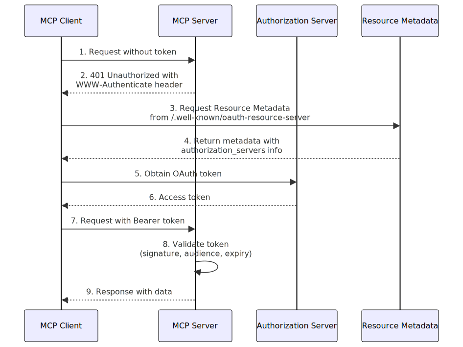
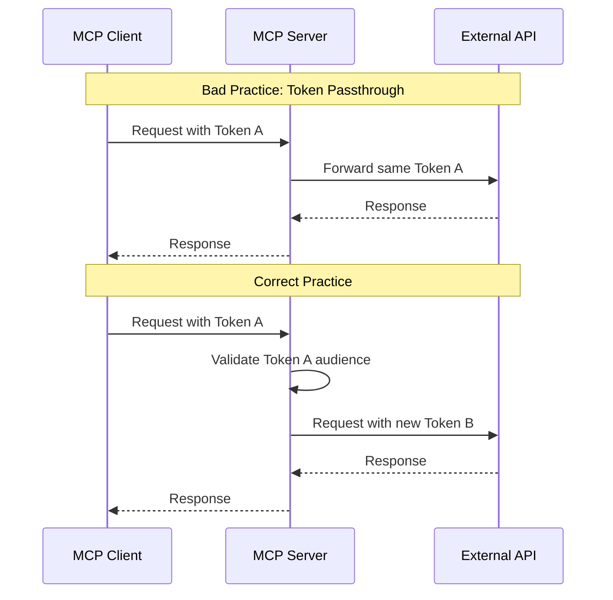
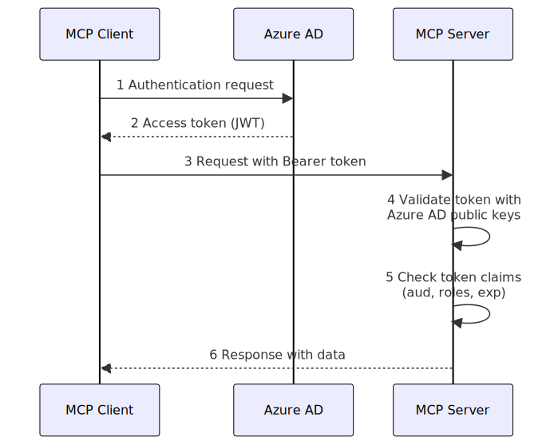

# Securing Your MCP Server: Implementing the 2025-06-18 Authentication Specification

*Estimated reading time: 10 minutes*

## Introduction

The Model Context Protocol (MCP) has emerged as a critical standard for enabling AI models to interact with external tools, data sources, and services. With the release of the [2025-06-18 specification](https://modelcontextprotocol.io/specification/2025-06-18), significant improvements in security and authentication have been introduced to address the evolving threat landscape facing AI systems and their integrations.

According to [Section 1 of the Authorization specification](https://modelcontextprotocol.io/specification/2025-06-18/basic/authorization#introduction), the MCP is designed to provide a standardized way for AI models to interact with external tools and resources, while maintaining security and privacy. The security requirements establish a robust framework for securing these interactions, with detailed guidance provided in both the [Authorization specification](https://modelcontextprotocol.io/specification/2025-06-18/basic/authorization) and [Security Best Practices](https://modelcontextprotocol.io/specification/2025-06-18/basic/security_best_practices) document.

This article provides a comprehensive guide for implementing secure authentication in your MCP server according to the latest specification. Whether you're building a new MCP server or upgrading an existing one, this guide will help you understand and implement the security mechanisms required for compliance.

*This article is based on the Model Context Protocol specification version 2025-06-18. For the latest updates, always refer to the official specification at [modelcontextprotocol.io](https://modelcontextprotocol.io/). You will find direct links to relevant sections throughout this article so you can easily navigate the document.*

## Understanding the MCP Security Model

Before diving into implementation details, it's essential to understand the core security model of MCP. As defined in the [MCP Authorization specification](https://modelcontextprotocol.io/specification/2025-06-18/basic/authorization), the protocol follows a client-server architecture with three key components:

1. **Host**: The application coordinating client instances
2. **Client**: The connector within the host application that establishes a 1:1 connection with a server
3. **Server**: The service providing context and capabilities to clients

From a security perspective, MCP servers are **Resource Servers** in the OAuth 2.1 terminology, as stated in [Section 2.1 of the Authorization specification](https://modelcontextprotocol.io/specification/2025-06-18/basic/authorization#roles). They accept access tokens issued by trusted Authorization Servers and validate these tokens before processing requests.



## Key Security Requirements in the 2025-06-18 Specification

The latest MCP specification requires HTTP-based MCP servers to implement the following security features:

1. **OAuth 2.1-based Authorization**: MCP servers must implement OAuth 2.1 for access control [(Section 1.3)](https://modelcontextprotocol.io/specification/2025-06-18/basic/authorization#standards-compliance)
2. **Resource Server Metadata**: Servers must implement OAuth 2.0 Protected Resource Metadata (RFC 9728) [(Section 2.3.1)](https://modelcontextprotocol.io/specification/2025-06-18/basic/authorization#authorization-server-location)
3. **Token Audience Validation**: Servers must validate that tokens were specifically issued for them [(Section 3.1)](https://modelcontextprotocol.io/specification/2025-06-18/basic/authorization#token-audience-binding-and-validation)
4. **No Token Passthrough**: Servers must never accept or forward tokens not specifically issued for them [(Section 2.6.2)](https://modelcontextprotocol.io/specification/2025-06-18/basic/authorization#token-handling)
5. **HTTPS Communication**: All production deployments must use HTTPS for secure communication [(Section 3.3)](https://modelcontextprotocol.io/specification/2025-06-18/basic/authorization#communication-security)

Let's explore how to implement these requirements in a TypeScript-based MCP server.

## Implementing Authorization in Your MCP Server

### Step 1: Set Up Protected Resource Metadata

The first step is implementing OAuth 2.0 Protected Resource Metadata (RFC 9728) to help clients discover how to obtain authorization, as required by [Section 2.3.1](https://modelcontextprotocol.io/specification/2025-06-18/basic/authorization#authorization-server-location) of the MCP specification. Create an endpoint that returns the metadata document:

```typescript
import express from 'express';
import { Router } from 'express';

// Create a router for the metadata endpoint
const router = Router();

router.get('/.well-known/oauth-resource-server', (req, res) => {
  res.json({
    resource_id: process.env.MCP_SERVER_URL || 'https://mcp.example.com/mcp',
    authorization_servers: [
      {
        issuer: process.env.AUTH_SERVER_ISSUER || 'https://auth.example.com',
        authorization_endpoint: process.env.AUTH_SERVER_AUTH_ENDPOINT || 'https://auth.example.com/authorize',
        token_endpoint: process.env.AUTH_SERVER_TOKEN_ENDPOINT || 'https://auth.example.com/token',
        registration_endpoint: process.env.AUTH_SERVER_REGISTRATION_ENDPOINT || 'https://auth.example.com/register',
        jwks_uri: process.env.AUTH_SERVER_JWKS_URI || 'https://auth.example.com/.well-known/jwks.json',
        scopes_supported: ['mcp.access', 'mcp.tools.read', 'mcp.tools.execute'],
        response_types_supported: ['code'],
        grant_types_supported: ['authorization_code', 'refresh_token'],
        token_endpoint_auth_methods_supported: ['client_secret_basic', 'client_secret_post', 'none'],
        service_documentation: 'https://docs.example.com/mcp-server',
        ui_locales_supported: ['en-US']
      }
    ]
  });
});

// Add the router to your Express app
app.use(router);
```

### Step 2: Implement Token Validation Middleware

Following the token validation requirements in [Section 2.6.2](https://modelcontextprotocol.io/specification/2025-06-18/basic/authorization#token-handling) and [Section 3.1](https://modelcontextprotocol.io/specification/2025-06-18/basic/authorization#token-audience-binding-and-validation) of the MCP specification, create a middleware to validate JWT tokens presented to your MCP server:

```typescript
import { Request, Response, NextFunction } from 'express';
import jwt from 'jsonwebtoken';
import jwksClient from 'jwks-rsa';

// Create JWKS client for token verification
const jwks = jwksClient({
  jwksUri: process.env.AUTH_SERVER_JWKS_URI || 'https://auth.example.com/.well-known/jwks.json',
  cache: true,
  cacheMaxAge: 86400000, // 24 hours
  rateLimit: true,
  jwksRequestsPerMinute: 10,
});

// Function to get signing key
const getSigningKey = (header: jwt.JwtHeader, callback: jwt.SigningKeyCallback) => {
  jwks.getSigningKey(header.kid, (err, key) => {
    if (err) {
      callback(err);
      return;
    }
    const signingKey = key.getPublicKey();
    callback(null, signingKey);
  });
};

// Token validation middleware
export const validateToken = async (req: Request, res: Response, next: NextFunction) => {
  // Extract token from Authorization header
  const authHeader = req.headers.authorization;
  if (!authHeader || !authHeader.startsWith('Bearer ')) {
    return res.status(401).json({
      error: {
        code: -32001,
        message: 'Authorization header missing or invalid'
      }
    });
  }

  const token = authHeader.split(' ')[1];

  try {
    // Verify token
    const decodedToken = await new Promise<jwt.JwtPayload>((resolve, reject) => {
      jwt.verify(
        token,
        getSigningKey,
        {
          algorithms: ['RS256'],
          audience: process.env.MCP_SERVER_URL || 'https://mcp.example.com/mcp',
          issuer: process.env.AUTH_SERVER_ISSUER || 'https://auth.example.com',
        },
        (err, decoded) => {
          if (err) reject(err);
          else resolve(decoded as jwt.JwtPayload);
        }
      );
    });

    // Store user information from token
    req.user = {
      id: decodedToken.sub || '',
      scopes: decodedToken.scope?.split(' ') || [],
      // Add other relevant user properties
    };
    
    next();
  } catch (error) {
    console.error('Token validation error:', error);
    
    // Return 401 with WWW-Authenticate header pointing to resource metadata
    return res.status(401)
      .setHeader('WWW-Authenticate', 
        'Bearer realm="mcp", error="invalid_token", ' +
        'resource_server_metadata="' + 
        `${req.protocol}://${req.get('host')}/.well-known/oauth-resource-server` + '"')
      .json({
        error: {
          code: -32001,
          message: 'Invalid or expired token'
        }
      });
  }
};
```

### Step 3: Apply the Middleware to Your MCP Endpoint

Protect your MCP endpoint with the token validation middleware:

```typescript
import express from 'express';
import { MCPServer } from './mcp-server';
import { validateToken } from './auth/token-validation';

const app = express();
const mcpServer = new MCPServer();

// Add the token validation middleware to the MCP endpoint
app.post('/mcp', validateToken, async (req, res) => {
  await mcpServer.handleRequest(req, res);
});
```

### Step 4: Implement WWW-Authenticate Response for 401 Errors

As specified in [Section 2.3.1](https://modelcontextprotocol.io/specification/2025-06-18/basic/authorization#authorization-server-location) and [Section 2.7](https://modelcontextprotocol.io/specification/2025-06-18/basic/authorization#error-handling) of the MCP specification, when requests arrive without valid tokens, return a 401 response with the `WWW-Authenticate` header pointing to your resource server metadata:

```typescript
// This can be applied as a catch-all error handler for unauthorized requests
app.use((err: any, req: Request, res: Response, next: NextFunction) => {
  if (err.name === 'UnauthorizedError' || err.status === 401) {
    res.status(401)
      .setHeader('WWW-Authenticate', 
        'Bearer realm="mcp", error="invalid_token", ' +
        'resource_server_metadata="' + 
        `${req.protocol}://${req.get('host')}/.well-known/oauth-resource-server` + '"')
      .json({
        error: {
          code: -32001,
          message: 'Authentication required'
        }
      });
    return;
  }
  next(err);
});
```

## Advanced Security Measures

### Role-Based Access Control for MCP Tools

The MCP specification recommends fine-grained access control using OAuth scopes. This aligns with the principle of least privilege as discussed in [Section 3.7](https://modelcontextprotocol.io/specification/2025-06-18/basic/authorization#access-token-privilege-restriction) of the Authorization specification. Implementing Role-Based Access Control (RBAC) ensures that clients can only access the tools they're authorized to use:

```typescript
// Define tool-permission mappings
const toolPermissions: Record<string, string[]> = {
  'add_todo': ['mcp.tools.write'],
  'list_todos': ['mcp.tools.read'],
  'complete_todo': ['mcp.tools.write'],
  'delete_todo': ['mcp.tools.admin'],
};

// Middleware to check tool permissions
export const checkToolPermission = (toolName: string) => {
  return (req: Request, res: Response, next: NextFunction) => {
    const user = req.user;
    if (!user) {
      return res.status(401).json({
        error: {
          code: -32001,
          message: 'Authentication required'
        }
      });
    }

    const requiredScopes = toolPermissions[toolName];
    if (!requiredScopes) {
      return res.status(400).json({
        error: {
          code: -32602,
          message: 'Unknown tool'
        }
      });
    }

    const hasRequiredScope = requiredScopes.some(scope => 
      user.scopes.includes(scope)
    );

    if (!hasRequiredScope) {
      return res.status(403).json({
        error: {
          code: -32603,
          message: `Insufficient permissions to call tool: ${toolName}`
        }
      });
    }

    next();
  };
};
```

### Prevent Token Passthrough and Audience Validation

One of the critical security requirements in the 2025-06-18 specification is preventing token passthrough, as explicitly stated in [Section 2.6.2](https://modelcontextprotocol.io/specification/2025-06-18/basic/authorization#token-handling) and further explained in the [Security Best Practices document](https://modelcontextprotocol.io/specification/2025-06-18/basic/security_best_practices#token-passthrough). This means your MCP server must never accept or forward tokens that weren't explicitly issued for it:



Here's how to implement audience validation in your MCP server:

```typescript
// Helper function to verify token audience
function verifyTokenAudience(token: string, expectedAudience: string): boolean {
  try {
    const decoded = jwt.decode(token, { complete: true });
    if (!decoded || typeof decoded !== 'object') return false;
    
    const { payload } = decoded;
    
    // Check audience claim
    if (typeof payload.aud === 'string') {
      return payload.aud === expectedAudience;
    } else if (Array.isArray(payload.aud)) {
      return payload.aud.includes(expectedAudience);
    }
    
    return false;
  } catch (error) {
    console.error('Audience validation error:', error);
    return false;
  }
}

// Middleware for audience validation
export const validateAudience = (req: Request, res: Response, next: NextFunction) => {
  const authHeader = req.headers.authorization;
  if (!authHeader || !authHeader.startsWith('Bearer ')) {
    return res.status(401).json({
      error: {
        code: -32001,
        message: 'Authorization header missing or invalid'
      }
    });
  }

  const token = authHeader.split(' ')[1];
  const expectedAudience = process.env.MCP_SERVER_URL || 'https://mcp.example.com/mcp';
  
  if (!verifyTokenAudience(token, expectedAudience)) {
    return res.status(403).json({
      error: {
        code: -32003,
        message: 'Token audience validation failed'
      }
    });
  }
  
  next();
};
```

### Security for External API Integration

Following the no token passthrough requirement ([Section 2.6.2](https://modelcontextprotocol.io/specification/2025-06-18/basic/authorization#token-handling) and [Section 3.7](https://modelcontextprotocol.io/specification/2025-06-18/basic/authorization#access-token-privilege-restriction)), if your MCP server integrates with external APIs, it must obtain separate tokens for these integrations and never pass through the tokens received from clients:

```typescript
// Correct approach: Get a separate token for the external API
async function callExternalApiSecurely(endpoint: string, data: any, user: any): Promise<any> {
  // Obtain a token for the external API using client credentials flow
  const apiToken = await getApiToken(user.id);
  
  // Call the external API with the new token
  const response = await fetch(endpoint, {
    method: 'POST',
    headers: {
      'Content-Type': 'application/json',
      'Authorization': `Bearer ${apiToken}`
    },
    body: JSON.stringify(data)
  });
  
  return response.json();
}

// Function to get an API-specific token
async function getApiToken(userId: string): Promise<string> {
  // Use client credentials flow to get token for the external API
  const tokenResponse = await fetch(process.env.AUTH_SERVER_TOKEN_ENDPOINT!, {
    method: 'POST',
    headers: {
      'Content-Type': 'application/x-www-form-urlencoded',
      'Authorization': `Basic ${Buffer.from(
        `${process.env.CLIENT_ID}:${process.env.CLIENT_SECRET}`
      ).toString('base64')}`
    },
    body: new URLSearchParams({
      grant_type: 'client_credentials',
      scope: 'api.access',
      resource: process.env.EXTERNAL_API_URL!,
      subject: userId // Optional: associate the token with the user
    }).toString()
  });
  
  const data = await tokenResponse.json();
  return data.access_token;
}
```

## Common Security Pitfalls and How to Avoid Them

### 1. Insufficient Token Validation

**Problem**: MCP servers may validate token signatures but fail to check critical claims like audience, issuer, or expiration, which violates the requirements in [Section 2.6.2](https://modelcontextprotocol.io/specification/2025-06-18/basic/authorization#token-handling) and [Section 3.1](https://modelcontextprotocol.io/specification/2025-06-18/basic/authorization#token-audience-binding-and-validation).

**Solution**: Always perform comprehensive token validation:

```typescript
// Complete token validation function
function validateTokenComprehensively(token: string, options: any): Promise<jwt.JwtPayload> {
  return new Promise((resolve, reject) => {
    jwt.verify(
      token, 
      getSigningKey, 
      {
        algorithms: ['RS256'],
        audience: process.env.MCP_SERVER_URL,
        issuer: process.env.AUTH_SERVER_ISSUER,
        complete: true,
        ...options
      },
      (err, decoded) => {
        if (err) reject(err);
        else resolve(decoded as jwt.JwtPayload);
      }
    );
  });
}
```

### 2. Session Hijacking Vulnerabilities

**Problem**: Using session IDs for authentication can lead to session hijacking, as detailed in the [Security Best Practices document (Section 2.3)](https://modelcontextprotocol.io/specification/2025-06-18/basic/security_best_practices#session-hijacking).

**Solution**: Require token validation on every request and don't rely on session state for authentication:

```typescript
// Do not use this approach for authentication
app.use(session({
  secret: 'session-secret',
  resave: false,
  saveUninitialized: false,
  cookie: { secure: true }
}));

// Instead, validate tokens on every request
app.use('/mcp', validateToken);
```

### 3. Missing HTTPS for Production

**Problem**: Using HTTP in production environments exposes tokens and sensitive data, violating the [communication security requirements (Section 3.3)](https://modelcontextprotocol.io/specification/2025-06-18/basic/authorization#communication-security).

**Solution**: Force HTTPS in production environments:

```typescript
import express from 'express';
import helmet from 'helmet';

const app = express();

// Enforce HTTPS in production
if (process.env.NODE_ENV === 'production') {
  app.use(helmet());
  app.use((req, res, next) => {
    if (!req.secure && req.get('x-forwarded-proto') !== 'https') {
      return res.redirect(`https://${req.get('host')}${req.url}`);
    }
    next();
  });
}
```

### 4. Overprivileged Access Tokens

**Problem**: Tokens with excessive permissions increase the damage potential if compromised, which is addressed in [Section 3.7](https://modelcontextprotocol.io/specification/2025-06-18/basic/authorization#access-token-privilege-restriction) of the specification.

**Solution**: Use the principle of least privilege and fine-grained scopes:

```typescript
// Define fine-grained permissions for each tool
const toolPermissions: Record<string, string[]> = {
  'add_todo': ['mcp.tools.todo.create'],
  'list_todos': ['mcp.tools.todo.read'],
  'complete_todo': ['mcp.tools.todo.update'],
  'delete_todo': ['mcp.tools.todo.delete'],
};
```

### 5. Hardcoded Secrets

**Problem**: Embedding secrets in source code creates security vulnerabilities, which relates to token theft prevention described in [Section 3.2](https://modelcontextprotocol.io/specification/2025-06-18/basic/authorization#token-theft).

**Solution**: Always use environment variables for secrets:

```typescript
// BAD: Hardcoded secrets
const jwtSecret = 'super-secret-key';

// GOOD: Environment variables
const jwtSecret = process.env.JWT_SECRET;
if (!jwtSecret) {
  throw new Error('JWT_SECRET environment variable is required');
}
```

## Integrating MCP Authentication with Azure AD

For enterprise applications, integrating MCP authentication with Azure Active Directory provides additional security benefits. 



Here's how to implement it:

```typescript
import { AuthorizationServer } from './models';

// Setup Azure AD as the authorization server for your MCP server
const azureADConfig: AuthorizationServer = {
  issuer: `https://login.microsoftonline.com/${process.env.AZURE_TENANT_ID}/v2.0`,
  authorization_endpoint: `https://login.microsoftonline.com/${process.env.AZURE_TENANT_ID}/oauth2/v2.0/authorize`,
  token_endpoint: `https://login.microsoftonline.com/${process.env.AZURE_TENANT_ID}/oauth2/v2.0/token`,
  jwks_uri: `https://login.microsoftonline.com/${process.env.AZURE_TENANT_ID}/discovery/v2.0/keys`,
  registration_endpoint: null, // Azure AD doesn't support dynamic registration
  scopes_supported: ['api://<your-app-id>/mcp.access'],
  response_types_supported: ['code'],
  grant_types_supported: ['authorization_code', 'refresh_token', 'client_credentials'],
  token_endpoint_auth_methods_supported: ['client_secret_post', 'private_key_jwt', 'client_secret_basic'],
};

// Expose Azure AD config in your resource server metadata
router.get('/.well-known/oauth-resource-server', (req, res) => {
  res.json({
    resource_id: process.env.MCP_SERVER_URL,
    authorization_servers: [azureADConfig]
  });
});
```

## Conclusion

Implementing the 2025-06-18 MCP authentication specification is essential for securing your MCP server against various threats. By following the OAuth 2.1 framework, validating token audiences, implementing proper token handling, and applying the principle of least privilege, you can build a secure MCP server that protects both your services and your users.

Remember that security is an ongoing process. Stay updated with the latest MCP specifications and security best practices to ensure your implementation remains resilient against emerging threats.

## Key Takeaways

1. MCP servers are OAuth 2.1 Resource Servers and must validate access tokens [(Section 2.1)](https://modelcontextprotocol.io/specification/2025-06-18/basic/authorization#roles)
2. Implement Protected Resource Metadata to help clients discover authorization requirements [(Section 2.3.1)](https://modelcontextprotocol.io/specification/2025-06-18/basic/authorization#authorization-server-location)
3. Always validate token audience claims to prevent token passthrough vulnerabilities [(Section 3.1)](https://modelcontextprotocol.io/specification/2025-06-18/basic/authorization#token-audience-binding-and-validation)
4. Use HTTPS for all production deployments [(Section 3.3)](https://modelcontextprotocol.io/specification/2025-06-18/basic/authorization#communication-security)
5. Implement fine-grained permissions for MCP tools using scopes [(Section 3.7)](https://modelcontextprotocol.io/specification/2025-06-18/basic/authorization#access-token-privilege-restriction)
6. Never forward client tokens to external services; obtain separate tokens instead [(Section 2.6.2)](https://modelcontextprotocol.io/specification/2025-06-18/basic/authorization#token-handling)
7. Store secrets securely using environment variables, never hardcode them [(Section 3.2)](https://modelcontextprotocol.io/specification/2025-06-18/basic/authorization#token-theft)

With these principles in mind, you can build MCP servers that are both powerful and secure, providing AI models with safe access to tools and data sources while protecting sensitive information.

---

*This article is based on the Model Context Protocol specification version 2025-06-18. For the latest updates, always refer to the official specification at [modelcontextprotocol.io](https://modelcontextprotocol.io/), particularly the [Authorization specification](https://modelcontextprotocol.io/specification/2025-06-18/basic/authorization) and [Security Best Practices](https://modelcontextprotocol.io/specification/2025-06-18/basic/security_best_practices).*
